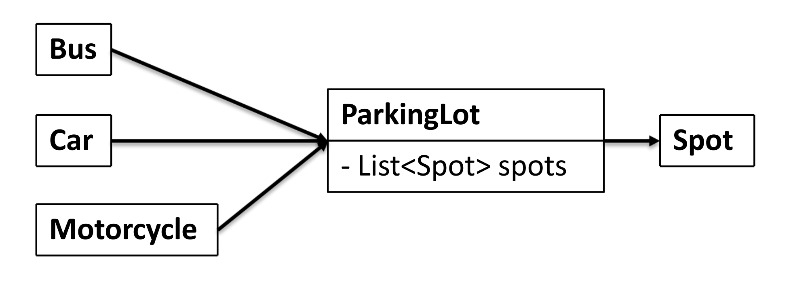

# Parking Lot 498 \(H\)

## Problem

Design a parking lot.

see CC150 OO Design for details.

1. `n` levels, each level has `m` rows of spots and each row has `k` spots.So each level has `m` x `k` spots.
2. The parking lot can park motorcycles, cars and buses
3. The parking lot has motorcycle spots, compact spots, and large spots
4. Each row, motorcycle spots id is in range `[0,k/4)(0 is included, k/4 is not included)`, compact spots id is in range `[k/4,k/4*3)(k/4*3 is not included)` and large spots id is in range `[k/4*3,k)(k is not included)`.
5. A motorcycle can park in any spot
6. A car park in single compact spot or large spot
7. A bus can park in five large spots that are consecutive and within same row. it can not park in small spots

Example

**Example 1**

```text
Input:level=1num_rows=1spots_per_row=11parkVehicle("Motorcycle_1")parkVehicle("Car_1")parkVehicle("Car_2")parkVehicle("Car_3")parkVehicle("Car_4")parkVehicle("Car_5")parkVehicle("Bus_1")unParkVehicle("Car_5")parkVehicle("Bus_1")Output:truetruetruetruetruetruefalsetrueExplanation: Parking Lot：Motorcycle: 0 1Car:        2 3 4 5Bus:        6 7 8 9 10When "Car_5" first got to the parking lot, there is no place for it in compact spots. The "Car_5" has to park in Bus spot 6. So "Bus_1" cannot park until "Car_5" left.
```

**Example 2**

```text
Input:level=1num_rows=1spots_per_row=14parkVehicle("Motorcycle_1")parkVehicle("Motorcycle_2")parkVehicle("Motorcycle_3")parkVehicle("Car_1")parkVehicle("Car_2")parkVehicle("Car_3")parkVehicle("Motorcycle_4")parkVehicle("Car_4")parkVehicle("Car_5")parkVehicle("Car_6")parkVehicle("Car_7")parkVehicle("Bus_1")unParkVehicle("Car_1")unParkVehicle("Motorcycle_4")unParkVehicle("Car_3")unParkVehicle("Car_6")parkVehicle("Bus_1")unParkVehicle("Car_7")parkVehicle("Bus_1")Output:truetruetruetruetruetruetruetruetruetruetruefalsefalsetrue
```

## Procedure

#### Clarify:

* Multi-level parking lots
* Vehicle: consider of 1. Bus 2. Car 3. Motorcycle
* No need to consider charging/handicapped parking
* Parking lots can show available spaces
* Flat fee

#### Core Object



#### Cases

Parking Lot:

* Get available count
* Park vehicle
* Clear spot
* Calculate price

Management user cases:

* Reservation: X
* Serve: Park vehicle
* Check out: Clear spot + Calculate price

## Solution 



```python

```



### Complexity Analysis

* **Time Complexity:**
* **Space Complexity:**

