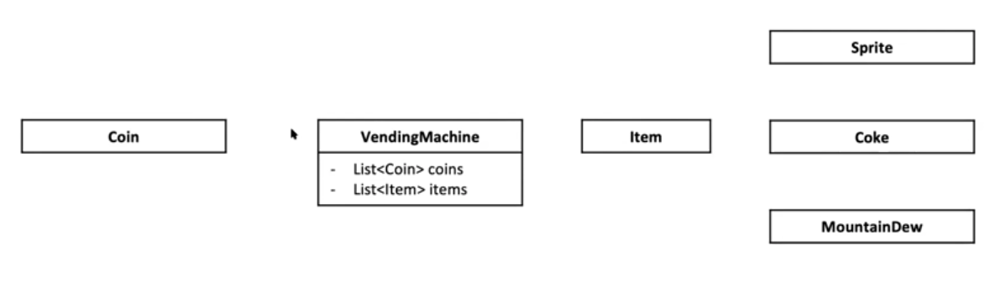
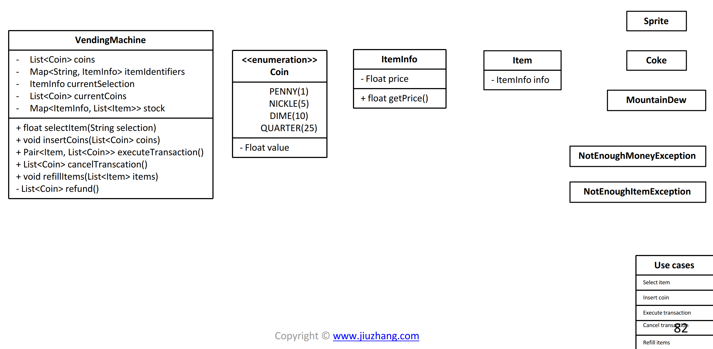
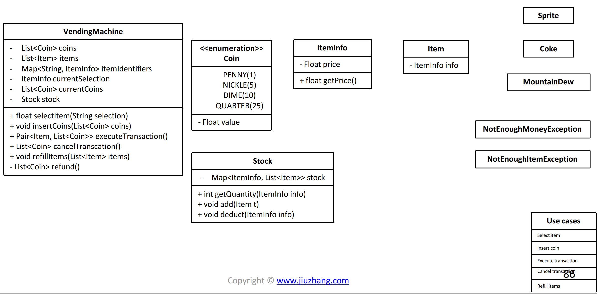
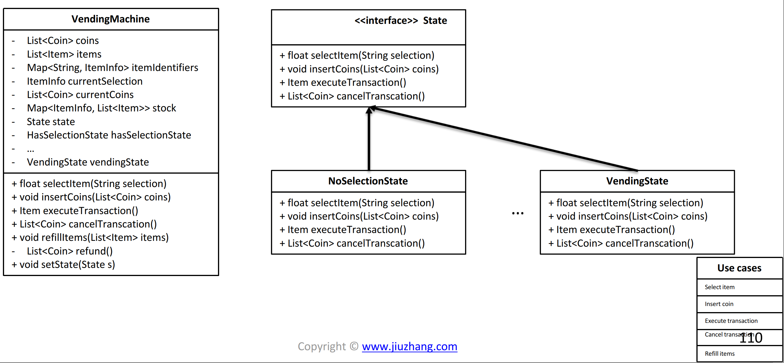

# Vending machine OO Design 712 \(H\)

## Problem

## Procedure

### Clarify


### Core Object



### Use Cases

Vending Machine

* Select item
* Insert coin
* Execute transaction
* Cancel transaction
* Refill items

### Classes

#### Use cases: 

* _Select item_: Vending machine takes an external input, shows the price of that item
* _Insert coin_: Insert a list of coins into vending machine
* _Execute transection_: 
  * Get the current selected item
  * Compare the item price and inserted coins
  * If not enough money, throw an exception
  * Else, return item that purchased
  * Refund if any
* _Cancel transection_: Return the current coins that has been inserted
* _Refill items_: Refill items on top of current stock



### 

### Inflexible Design 



```java
stock = new HashMap<ItemInfo, List<Item>>();
public void refillItem(List<Item> items)
{
    for (Item item: items)
    {
        ItemInfo info = item.getInfo();
        List<Item> itemsInStock = stock.get(info);
        itemsInStock.add(item);
        stock.put(info, itemsInStock);
    }
}
```







### Better Design on class



```java
class Stock
{
    private HashMap<ItemInfo, List<Item>> stock;
    
    public void add(Item item)
    {
        ItemInfo info = item.getInfo();
        List<Item> itemsInStock = stock.get(info);
        itemsInStock.add(item);
        stock.put(info, itemsInStock);
    }
}

stock = new Stock();

public void refillItem(List<Item> items)
{
    for(Item item:items)
    {
        stock.add(item);
    }
}
```



```python

```





### State Design Pattern

For uses cases, what if there is no item is selected, or no coins inserted....etc, Insert coin\(\), Execute transaction\(\), Cancel transaction\(\) will all need to handle for exception. However, it's quite a redundant using if else condition like following:



```java
public void insertCoin(List<Coin> coins)
{
    if (selectedItem == null)
    {
        throw new Exception("You need to make a selection first");
    }
    else if (selectedItem != null)
    {
        currentCoins.add(coins);
    }
}
```







#### With state design



## Solution 



```python

```



```java
public class VendingMachine {
	private String currentSelectedItem;
	private int currentInsertedMoney;
	private AbstractState state;
	private NoSelectionState noSelectionState;
	private HasSelectionState hasSelectionState;
	private InsertedMoneyState insertedMoneyState;
	private Map<String, Integer> itemPrice;

	public VendingMachine() {
		currentInsertedMoney = 0;
		currentSelectedItem = null;
		noSelectionState = new NoSelectionState(this);
		hasSelectionState = new HasSelectionState(this);
		insertedMoneyState = new InsertedMoneyState(this);
		state = noSelectionState;

		itemPrice = new HashMap<>();
		itemPrice.put("Coke", 199);
		itemPrice.put("Sprite", 299);
		itemPrice.put("MountainDew", 399);
	}

	public void setSelectedItem(String item) {
		this.currentSelectedItem = item;
	}

	public String getSelectedItem() {
		return currentSelectedItem;
	}

	public void insertMoney(int amount) {
		this.currentInsertedMoney += amount;
	}

	public void emptyInsertedMoney() {
		this.currentInsertedMoney = 0;
	}

	public int getInsertedMoney() {
		return currentInsertedMoney;
	}

	public int getSalePrice() {
		if (currentSelectedItem == null) {
			System.out.println("Please make a selection before asking price");
			return 0;
		} else {
			return itemPrice.get(currentSelectedItem);
		}
	}

	public void changeToNoSelectionState() {
		state = noSelectionState;
	}

	public void changeToHasSelectionState() {
		state = hasSelectionState;
	}

	public void changeToInsertedMoneyState() {
		state = insertedMoneyState;
	}

	public void selectItem(String selection) {
		state.selectItem(selection);
	}

	public void addMoney(int value) {
		state.insertMoney(value);
	}

	public void executeTransaction() {
		state.executeTransaction();
	}

	public int cancelTransaction() {
		return state.cancelTransaction();
	}

	public String printState() {
		String res = "";

		res = "Current selection is: " + currentSelectedItem + ", current inserted money: " + currentInsertedMoney
				+ ", current state is : " + state;

		return res;
	}
}

interface State {
	public void selectItem(String selection);
	public void insertMoney(int value);
	public void executeTransaction();
	public int cancelTransaction();
	public String toString();
}

abstract class AbstractState implements State {
	protected VendingMachine vendingMachine;

	public AbstractState(VendingMachine vendingMachine) {
		this.vendingMachine = vendingMachine;
	}
}

class NoSelectionState extends AbstractState{

	public NoSelectionState(VendingMachine vendingMachine) {
		super(vendingMachine);
		// TODO Auto-generated constructor stub
	}

	@Override
	public void selectItem(String selection) {
		// TODO Auto-generated method stub
		vendingMachine.setSelectedItem(selection);
		vendingMachine.changeToHasSelectionState();
	}

	@Override
	public void insertMoney(int value) {
		// TODO Auto-generated method stub
		System.out.println("Please make a selection first");
	}

	@Override
	public void executeTransaction() {
		// TODO Auto-generated method stub
		System.out.println("Please make a selection first");
	}

	@Override
	public int cancelTransaction() {
		// TODO Auto-generated method stub
		System.out.println("Please make a selection first");
		return 0;
	}

	@Override
	public String toString(){
		return "NoSelection";
	}
}

class HasSelectionState extends AbstractState{

	public HasSelectionState(VendingMachine vendingMachine) {
		super(vendingMachine);
		// TODO Auto-generated constructor stub
	}

	@Override
	public void selectItem(String selection) {
		// TODO Auto-generated method stub
		vendingMachine.setSelectedItem(selection);
	}

	@Override
	public void insertMoney(int value) {
		// TODO Auto-generated method stub
		vendingMachine.insertMoney(value);
		vendingMachine.changeToInsertedMoneyState();
	}

	@Override
	public void executeTransaction() {
		// TODO Auto-generated method stub
		System.out.println("You need to insert money first");
	}

	@Override
	public int cancelTransaction() {
		// TODO Auto-generated method stub
		System.out.println("Transaction canceled");
		vendingMachine.setSelectedItem(null);
		vendingMachine.changeToNoSelectionState();
		return 0;
	}
	@Override
	public String toString(){
		return "HasSelection";
	}
}

class InsertedMoneyState extends AbstractState{

	public InsertedMoneyState(VendingMachine vendingMachine) {
		super(vendingMachine);
		// TODO Auto-generated constructor stub
	}

	@Override
	public void selectItem(String selection) {
		// TODO Auto-generated method stub
		System.out.println("Already has a selection, please cancel transaction to make a new selection");
	}

	@Override
	public void insertMoney(int value) {
		// TODO Auto-generated method stub
		vendingMachine.insertMoney(value);
	}

	@Override
	public void executeTransaction() {
		// TODO Auto-generated method stub
		int diff = vendingMachine.getInsertedMoney() - vendingMachine.getSalePrice();
		if(diff >= 0){
			System.out.println("Executing transaction, will return you : " + diff + " money and item: " + vendingMachine.getSelectedItem());
			vendingMachine.setSelectedItem(null);
			vendingMachine.emptyInsertedMoney();
			vendingMachine.changeToNoSelectionState();
		}
		else{
			System.out.println("Not enough money, please insert " + (-diff) + " more.");
		}
	}

	@Override
	public int cancelTransaction() {
		// TODO Auto-generated method stub
		int insertedMoney = vendingMachine.getInsertedMoney();
		vendingMachine.setSelectedItem(null);
		vendingMachine.emptyInsertedMoney();
		vendingMachine.changeToNoSelectionState();
		return insertedMoney;
	}

	@Override
	public String toString(){
		return "InsertedMoney";
	}
}
```



### Complexity Analysis

* **Time Complexity:**
* **Space Complexity:**

